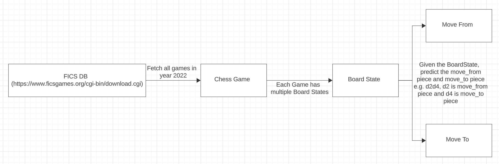

fide-google-chess-ui
====================

## Run the game

```aiignore
python3 chess_game_ui.py
```

## Pretrained models

Pretrained models are present in https://github.com/sbcd90/kaggle-competitions/blob/main/fide-google-efficient-chess-challenge/Archive.zip

## Design

